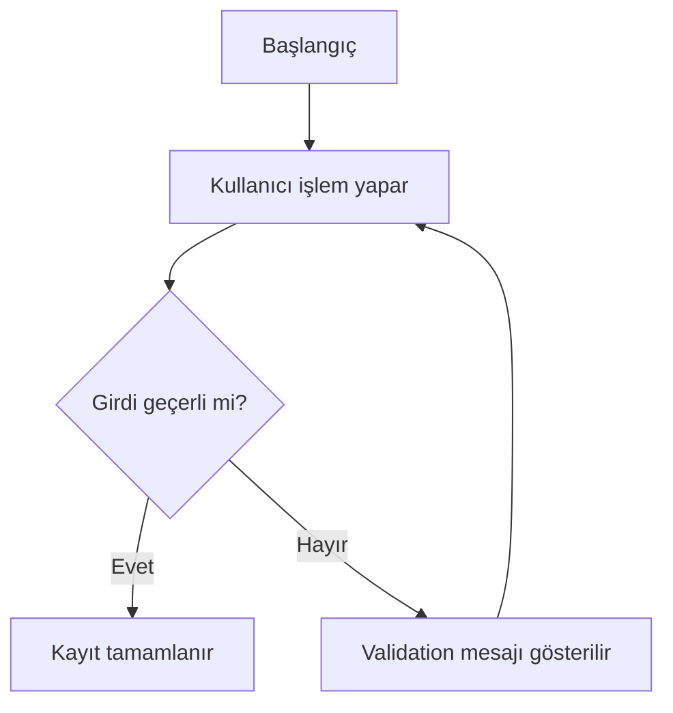

# Knitwise Feature Documentation Template

## Document Information

| Alan            | Değer               |
| --------------- | ------------------- |
| Product         | Knitwise            |
| Feature ID      | FEATURE-XXX         |
| Feature Name    | Feature Name        |
| Priority        | P0 / P1 / P2 / P3   |
| Planned Release | V1 / V1.x / V2 / V3 |
| Status          | Proposed            |
| Product Owner   | Product             |
| Technical Owner | TBD                 |
| Version         | 0.1                 |
| Last Updated    | YYYY-MM-DD          |

---

# Template Usage

Bu şablon yeni bir Knitwise özelliği oluşturulurken kullanılacak standart yapıyı tanımlar.

Her özellik için bu belgenin tamamının tek dosyaya kopyalanması gerekmez.

İlgili bölümler feature klasöründeki ayrı belgelere dağıtılmalıdır.

Örnek:

```text
Feature Summary
→ overview.md

User Stories
→ user-stories.md

Functional Requirements
→ requirements.md

Business Rules
→ business-rules.md
```

Şablonda bulunan açıklama metinleri, gerçek feature içeriği hazırlanırken kaldırılmalıdır.

---

# 1. Feature Summary

## 1.1 Purpose

Özelliğin ne yaptığını ve neden var olduğunu kısa ve açık biçimde tanımla.

Aşağıdaki soruları cevapla:

* Özellik hangi problemi çözüyor?
* Kullanıcıya hangi değeri sunuyor?
* Knitwise ürün stratejisine nasıl katkı sağlıyor?

## 1.2 User Problem

Kullanıcının mevcut durumda yaşadığı problemi açıkla.

Problem:

* gözlemlenebilir,
* kullanıcı odaklı,
* çözümden bağımsız

olarak yazılmalıdır.

## 1.3 Proposed Solution

Knitwise'ın bu probleme sunduğu çözümü özetle.

## 1.4 Product Value

Özelliğin aşağıdaki alanlara etkisini değerlendir:

* Kullanıcı değeri
* Retention
* Engagement
* Premium dönüşüm
* Ürün farklılaşması
* Operasyon maliyeti
* Teknik risk

## 1.5 Target Users

Özelliği kullanacak ana persona veya kullanıcı segmentlerini belirt.

## 1.6 Jobs to Be Done

Örnek format:

> Kullanıcı örgü projesi üzerinde çalışırken ilerlemesini kaybetmeden takip etmek ister.

---

# 2. Goals and Non-Goals

## 2.1 Goals

Özelliğin ulaşması gereken hedefleri yaz.

Her hedef:

* açık,
* ölçülebilir,
* feature kapsamıyla doğrudan ilişkili

olmalıdır.

## 2.2 Non-Goals

Özelliğin bu sürümde çözmeyeceği konuları açıkça belirt.

Non-goal yazmak scope creep riskini azaltır.

---

# 3. Scope

## 3.1 In Scope

Bu sürümde geliştirilecek davranışları listele.

## 3.2 Out of Scope

Bu feature kapsamında geliştirilmeyecek davranışları listele.

## 3.3 Future Scope

Gelecek sürümlerde değerlendirilebilecek geliştirmeleri belirt.

---

# 4. User Stories

Her kullanıcı hikâyesine benzersiz kimlik ver.

Format:

```text
PREFIX-US-001
```

Şablon:

## PREFIX-US-001 — Story Title

**As a:** Kullanıcı tipi

**I want to:** Yapmak istediği işlem

**So that:** Elde edeceği fayda

### Preconditions

* Ön koşul 1
* Ön koşul 2

### Main Scenario

1. Kullanıcı...
2. Sistem...
3. Kullanıcı...
4. Sistem...

### Alternative Scenarios

* Alternatif senaryo

### Failure Scenarios

* Hata senaryosu

### Related Requirements

* `PREFIX-FR-001`

### Related Acceptance Criteria

* `PREFIX-AC-001`

---

# 5. Functional Requirements

Her gereksinime benzersiz kimlik ver.

Format:

```text
PREFIX-FR-001
```

## Requirement Template

### PREFIX-FR-001 — Requirement Name

**Priority:** Must / Should / Could

**Description:**

Sistemin yapması gereken davranış.

**Rationale:**

Bu gereksinimin neden gerekli olduğu.

**Preconditions:**

* Gerekli ön koşullar

**Inputs:**

* Girdi

**System Behavior:**

* Beklenen sistem davranışı

**Outputs:**

* Çıktı

**Failure Behavior:**

* İşlem başarısız olduğunda beklenen davranış

**Dependencies:**

* Bağımlı feature veya sistem

**Related Business Rules:**

* `PREFIX-BR-001`

**Related Acceptance Criteria:**

* `PREFIX-AC-001`

---

# 6. Non-Functional Requirements

Format:

```text
PREFIX-NFR-001
```

Değerlendirilmesi gereken kategoriler:

## 6.1 Performance

* İşlem yanıt süreleri
* Liste yükleme süreleri
* Büyük veri davranışı
* Animasyon akıcılığı

## 6.2 Reliability

* Veri kaybını önleme
* Otomatik kayıt
* Hata sonrası kurtarma
* Transaction bütünlüğü

## 6.3 Accessibility

* Screen reader
* Dynamic text
* Touch target
* Contrast
* Haptic feedback
* Voice control

## 6.4 Offline Behavior

* İnternet yokken kullanılabilen işlemler
* Local save
* Retry
* Sync state

## 6.5 Localization

* Türkçe ve İngilizce metinler
* Tarih formatı
* Ölçü sistemi
* Örgü terminolojisi
* Çoğul kuralları

## 6.6 Security

* Authentication
* Authorization
* RLS
* Storage access
* Sensitive logs
* Input validation

## 6.7 Compatibility

* Desteklenen iOS sürümleri
* Desteklenen Android sürümleri
* Ekran boyutları
* Tablet davranışı

---

# 7. Business Rules

Format:

```text
PREFIX-BR-001
```

## Rule Template

### PREFIX-BR-001 — Rule Name

**Rule:**

Zorunlu ürün davranışı.

**Reason:**

Kuralın amacı.

**Applies When:**

Kuralın geçerli olduğu koşullar.

**Exceptions:**

Varsa istisnalar.

**Validation Message:**

Kullanıcıya gösterilecek hata veya açıklama mesajı.

**Related Requirements:**

* `PREFIX-FR-001`

**Related Acceptance Criteria:**

* `PREFIX-AC-001`

---

# 8. User Flows

Her kullanıcı akışı için aşağıdaki yapı kullanılmalıdır.

## Flow Name

**Flow ID:** `PREFIX-FLOW-001`

**Actor:** Kullanıcı tipi

**Trigger:** Akışı başlatan işlem

**Preconditions:**

* Ön koşullar

**Success Outcome:**

* Başarılı sonuç

**Failure Outcome:**

* Başarısız sonuç

### Main Flow

1. Kullanıcı...
2. Sistem...
3. Kullanıcı...
4. Sistem...

### Alternative Flow A

1. Kullanıcı...
2. Sistem...

### Error Flow A

1. Sistem hata algılar.
2. Kullanıcıya açıklayıcı mesaj gösterilir.
3. Kullanıcının verisi korunur.

### Mermaid Example



---

# 9. Data Model

## 9.1 Entity Definition

### Entity Name

| Field      | Type     | Required | Default      | Validation    | Description           |
| ---------- | -------- | -------: | ------------ | ------------- | --------------------- |
| id         | UUID     |      Yes | Generated    | Valid UUID    | Primary identifier    |
| user_id    | UUID     |      Yes | None         | Existing user | Record owner          |
| created_at | DateTime |      Yes | Current time | ISO 8601      | Creation timestamp    |
| updated_at | DateTime |      Yes | Current time | ISO 8601      | Last update timestamp |

## 9.2 Relationships

| Source Entity | Relationship | Target Entity | Delete Behavior               |
| ------------- | ------------ | ------------- | ----------------------------- |
| Entity A      | One-to-many  | Entity B      | Restrict / Cascade / Set null |

## 9.3 Enumerations

Enum değerlerini açıkça tanımla.

Örnek:

```text
draft
active
paused
completed
archived
```

## 9.4 Validation Rules

* Zorunlu alanlar
* Minimum ve maksimum uzunluk
* Sayısal sınırlar
* Tarih kuralları
* Unique kuralları
* Cross-field validation

## 9.5 Index Requirements

Arama ve filtreleme için gerekli index'leri belirt.

## 9.6 Migration Considerations

* Eski veri davranışı
* Default değerler
* Nullable alanlar
* Backward compatibility
* Rollback yaklaşımı

---

# 10. UI and UX Requirements

## 10.1 Entry Points

Özelliğe hangi ekranlardan ulaşılacağını tanımla.

## 10.2 Screens

Gerekli ekranları ve amaçlarını listele.

## 10.3 Components

Gerekli temel UI bileşenlerini belirt.

## 10.4 States

Her ekran için şu durumları değerlendir:

* Loading
* Empty
* Populated
* Error
* Offline
* Disabled
* Locked
* Read-only
* Success

## 10.5 Validation Messages

Kullanıcıya gösterilecek validation mesajlarını belirt.

## 10.6 Accessibility Behavior

* Semantics label
* Screen reader sırası
* Dynamic text
* Minimum touch target
* Focus sırası
* Haptic veya sesli geri bildirim

---

# 11. Edge Cases

Format:

```text
PREFIX-EC-001
```

## Edge Case Template

### PREFIX-EC-001 — Scenario Name

**Scenario:**

Olağan dışı durum.

**Trigger:**

Durumu oluşturan koşul.

**Expected Behavior:**

Sistemin göstermesi gereken davranış.

**Data Impact:**

Verinin nasıl korunacağı veya değişeceği.

**User Message:**

Gösterilecek mesaj.

**Recovery:**

Kullanıcının veya sistemin normal duruma nasıl döneceği.

**Related Tests:**

* `PREFIX-TEST-001`

---

# 12. Acceptance Criteria

Format:

```text
PREFIX-AC-001
```

## Given–When–Then Template

### PREFIX-AC-001 — Criterion Name

```gherkin
Given [başlangıç koşulu]
And [ek koşul]
When [kullanıcı veya sistem aksiyonu]
Then [beklenen sonuç]
And [ek beklenen sonuç]
```

## Acceptance Criterion Rules

Kabul kriteri:

* test edilebilir,
* tek anlamlı,
* gözlemlenebilir,
* feature kapsamıyla ilişkili

olmalıdır.

---

# 13. Analytics

Format:

```text
PREFIX-AN-001
```

## Event Template

### Event Name

```text
feature_action_completed
```

**Event ID:** `PREFIX-AN-001`

**Trigger:**

Event'in gönderileceği kesin an.

**Purpose:**

Event'in cevaplayacağı ürün sorusu.

**Properties:**

| Property | Type   | Required | Allowed Values | Privacy Note        |
| -------- | ------ | -------: | -------------- | ------------------- |
| source   | String |      Yes | allowed values | No personal content |

**Must Not Include:**

* Kullanıcı tarafından yazılan özel metin
* Tarif içeriği
* Proje notları
* E-posta
* Dosya adı
* Görsel yolu
* Hassas kimlik bilgisi

## Feature Metrics

* Adoption
* Activation
* Completion
* Error rate
* Repeat usage
* Retention contribution
* Premium conversion contribution

---

# 14. Security and Privacy

Format:

```text
PREFIX-SEC-001
```

Değerlendirilmesi gereken alanlar:

## 14.1 Authorization

* Kullanıcı yalnızca kendi verisine erişebilir.
* Admin veya public içerik kuralları açıkça tanımlanmalıdır.

## 14.2 Row Level Security

Her kullanıcı tablosu için:

* SELECT policy
* INSERT policy
* UPDATE policy
* DELETE policy

gereksinimleri belirtilmelidir.

## 14.3 Input Validation

* Uzunluk
* Veri tipi
* Dosya türü
* Dosya boyutu
* Zararlı içerik
* Sayısal sınır

## 14.4 Storage

* Bucket yapısı
* Path ownership
* Signed URL
* Public veya private erişim
* Silme davranışı

## 14.5 Logging

Loglara yazılmaması gereken verileri belirt.

## 14.6 Data Export

Kullanıcının bu feature verisini dışa aktarabilme gereksinimini belirt.

## 14.7 Account Deletion

Hesap silindiğinde feature verisinin davranışını tanımla.

## 14.8 Retention

Verinin ne kadar süre saklanacağını belirt.

---

# 15. Testing Strategy

Format:

```text
PREFIX-TEST-001
```

## 15.1 Unit Tests

İş kuralları, validation ve hesaplama testleri.

## 15.2 Widget Tests

Ekran durumları ve kullanıcı etkileşimleri.

## 15.3 Integration Tests

Database, repository, authentication ve storage bağlantıları.

## 15.4 End-to-End Tests

Gerçek kullanıcı yolculukları.

## 15.5 Manual Tests

Görsel ve cihaz bazlı kontroller.

## 15.6 Accessibility Tests

* Screen reader
* Dynamic type
* Contrast
* Touch target
* Focus order

## 15.7 Offline Tests

* İnternet kaybı
* Local save
* Uygulamayı kapatma
* Retry
* Sync geri dönüşü

## 15.8 Security Tests

* Başka kullanıcı verisine erişim
* Manipüle edilmiş ID
* RLS
* Storage path
* Invalid input

## 15.9 Performance Tests

* Büyük veri seti
* Liste scroll performansı
* Kayıt süresi
* Açılış süresi
* Hafıza kullanımı

## Test Case Template

### PREFIX-TEST-001 — Test Name

**Type:** Unit / Widget / Integration / E2E / Manual

**Priority:** Critical / High / Medium / Low

**Related Requirement:**

* `PREFIX-FR-001`

**Related Acceptance Criterion:**

* `PREFIX-AC-001`

**Preconditions:**

* Ön koşullar

**Steps:**

1. Adım
2. Adım
3. Adım

**Expected Result:**

Beklenen sonuç.

---

# 16. Dependencies

## 16.1 Product Dependencies

Bağlı feature'ları listele.

## 16.2 Technical Dependencies

Gerekli package, service veya altyapıyı listele.

## 16.3 Design Dependencies

Gerekli tasarım bileşenlerini belirt.

## 16.4 Content Dependencies

Tarif, glossary veya yardım içeriği gibi gerekli içerikleri belirt.

## 16.5 Legal Dependencies

Gizlilik, lisans veya abonelik gereksinimlerini belirt.

---

# 17. Risks

Her risk için aşağıdaki yapı kullanılmalıdır.

| Risk             | Probability         | Impact              | Mitigation     | Owner |
| ---------------- | ------------------- | ------------------- | -------------- | ----- |
| Risk description | Low / Medium / High | Low / Medium / High | Planned action | Role  |

Risk kategorileri:

* Product risk
* UX risk
* Technical risk
* Security risk
* Privacy risk
* Cost risk
* Content risk
* Store review risk

---

# 18. Rollout Strategy

Özelliğin nasıl yayınlanacağını belirt.

Seçenekler:

* Internal only
* Closed beta
* Feature flag
* Percentage rollout
* Premium users first
* Specific region
* General availability

Aşağıdakileri açıkla:

* Entry criteria
* Health metrics
* Pause conditions
* Rollback behavior
* Exit criteria

---

# 19. Success Metrics

Özelliğin başarılı olup olmadığını gösterecek metrikleri belirt.

## Primary Metric

Özelliğin ana başarı metriği.

## Secondary Metrics

Destekleyici metrikler.

## Guardrail Metrics

Özellik geliştirilirken bozulmaması gereken metrikler.

Örnek:

* Crash rate
* Error rate
* Uninstall rate
* Support requests
* Data loss incidents

---

# 20. Open Questions

Henüz karar verilmemiş konuları listele.

| ID     | Question      | Owner   | Target Decision    | Status |
| ------ | ------------- | ------- | ------------------ | ------ |
| OQ-001 | Open question | Product | Before development | Open   |

Kritik açık sorular çözülmeden feature `Ready for Development` durumuna alınmamalıdır.

---

# 21. Decision Log

Feature'a özel kararlar burada özetlenebilir.

Önemli ve geniş etkili kararlar ayrıca ana dizindeki `DECISIONS.md` dosyasına eklenmelidir.

| Date       | Decision | Reason | Impact         |
| ---------- | -------- | ------ | -------------- |
| YYYY-MM-DD | Decision | Reason | Affected areas |

---

# 22. Definition of Ready Checklist

* [ ] Problem açıkça tanımlandı
* [ ] Hedef kullanıcı belirlendi
* [ ] Kapsam yazıldı
* [ ] Kapsam dışı alanlar yazıldı
* [ ] User story'ler tamamlandı
* [ ] Functional requirements tamamlandı
* [ ] Non-functional requirements tamamlandı
* [ ] Business rules tamamlandı
* [ ] User flows tamamlandı
* [ ] Data model taslağı hazır
* [ ] Edge case'ler değerlendirildi
* [ ] Acceptance criteria tamamlandı
* [ ] Analytics planlandı
* [ ] Security ve privacy gereksinimleri tamamlandı
* [ ] Testing planı tamamlandı
* [ ] Bağımlılıklar belirlendi
* [ ] Kritik açık karar kalmadı
* [ ] Product Owner onayı alındı

---

# 23. Definition of Done Checklist

* [ ] Must gereksinimleri geliştirildi
* [ ] Kabul kriterleri geçti
* [ ] Unit testler geçti
* [ ] Widget testler geçti
* [ ] Integration testleri geçti
* [ ] E2E ana akışları geçti
* [ ] Offline davranış test edildi
* [ ] Erişilebilirlik kontrol edildi
* [ ] Analytics event'leri doğrulandı
* [ ] Security kontrolleri tamamlandı
* [ ] RLS testleri geçti
* [ ] Kritik ve yüksek hata bulunmuyor
* [ ] Dokümantasyon güncellendi
* [ ] `CHANGELOG.md` güncellendi
* [ ] Product Owner kabulü alındı

---

# 24. References

Her feature belgesinde ilgili referansları belirt.

Örnek:

* `PROJECT_PRINCIPLES.md`
* `DECISIONS.md`
* `02-prd/overview.md`
* `02-prd/mvp-roadmap.md`
* `02-prd/feature-priorities.md`
* `02-prd/premium-strategy.md`
* İlgili diğer feature klasörleri
* İlgili UX belgeleri
* İlgili UI belgeleri
* İlgili technical belgeler
* İlgili testing belgeleri
